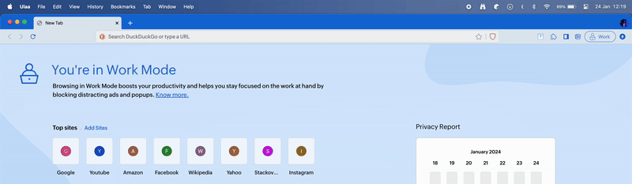

# Slash Space Go

## Slash, Space, and Go - that's all it takes!

With our extension, assign unique shortcuts to your favorite websites and text
snippets!

Hit `/` (slash) and `space` on your omnibox/search bar and hit your shortcut
name to Go on any saved website and to enter a snippet write the snippet
shortcut hit tab to auto-fill text.

## Slash Space Go Search:

Click on the extension icon while on any site, enter your desired shortcut, and
save it. Now, to visit that website, simply type `/` and space in the search bar
or omnibox, followed by your shortcut. Slash Space Go will instantly navigate to
the linked website. Simplify your browsing experience with Slash Space Go!

Slash Space Go! is a powerful browser extension designed to revolutionize the
way you navigate the web. With this tool, you can create custom shortcuts for
your most frequently visited websites, making browsing faster, more efficient,
and personalized to your needs.

Imagine this: You're working on a project and need to frequently visit a
specific Notion page for notes. Instead of searching for the page each time or
scrolling through a long list of bookmarks, you can simply save it as `/notes`.
Now, whenever you need to access the page, just type `/notes` into your
browser's omnibox, and you're there in an instant!

Or perhaps you're in the middle of a lengthy YouTube tutorial but need to pause
and return later. No need to bookmark or save the link elsewhere. Just assign a
shortcut like '/ytutorial', and you can easily return to the exact point you
left off.

The same goes for your favorite news site (saved as `/news`), your most-used
Google Doc (saved as `/doc`), or even a complex web app you're testing (saved as
'/test'). The possibilities are endless!

What's more, Slash Space Go! is not case-sensitive. Whether you type `/notes` or
`/NOTES`, you'll be directed to your desired website. And if you enter a
shortcut that doesn't exist, you'll receive a notification, ensuring you're
always in control.

The extension also helps manage your shortcuts. If you try to save a website
that's already saved, you'll get a popup stating it's already linked. Similarly,
repeating shortcut names is not allowed for clarity and ease of use. And don't
worry about long, complicated shortcuts - there's a limit of 15 characters,
keeping your shortcuts quick and easy to type.

In essence, Slash Space Go! is more than just a tool - it's a new way of
browsing. It's about making the internet work for you, not the other way around.
So why wait? Start your journey with Slash Space Go! today and experience the
web like never before.

## Slash Space Snippets:

Tired of typing the same things over and over? Slash Space Go Snippets comes to
the rescue. Create custom shortcuts for frequently used text and autofill them
instantly with a single tab.

### Here's how it works:

1. Save your snippet: Enter your desired text (snippet text) and give it a
   unique name(snippet shortcut).
2. Use it anywhere: On any website, simply type the snippet name followed by
   [tab] and voila! Your text is instantly inserted.
3. Flexibility at your fingertips: Unlike other tools, Slash Space Go Snippets
   doesn't automatically trigger completions. You have full control, ensuring
   accuracy and preventing unwanted expansions.

### Boost your productivity with Slash Space Go Snippets:

- Save hours: Eliminate repetitive typing and focus on what matters most.
- Reduce errors: Autofill ensures accuracy and consistency in your writing.
- Increase efficiency: Streamline your workflow and get more done.
- Works everywhere: Slash Space Go Snippets works seamlessly across all
  websites and applications.

### More than just snippets:

- Dynamic content: Use placeholders to personalize your snippets with dates,
  formulas, or website information.
- Powerful features: Customize fonts, add images, and build forms with
  interactive fields.

### Slash Space Go Snippets is perfect for:

- Customer support teams
- Teachers
- Healthcare professionals
- Recruiters
- Sales teams
- Marketing professionals
- Lawyers
- Real estate agents
- Writers
- Students
- And anyone else who wants to save time and improve their typing efficiency

**Ready to experience the power of Slash Space Go Snippets? Download the
extension today and start saving time!**

### Additional benefits:

- Simple and intuitive interface: Easy to use for everyone, regardless of
  technical expertise.
- Secure and reliable: Your data is always stored locally.
- Trusted by thousands: Join a growing community of users who love Slash Space
  Go Snippets.

**_Get started today and unlock the power of efficient typing!_**
